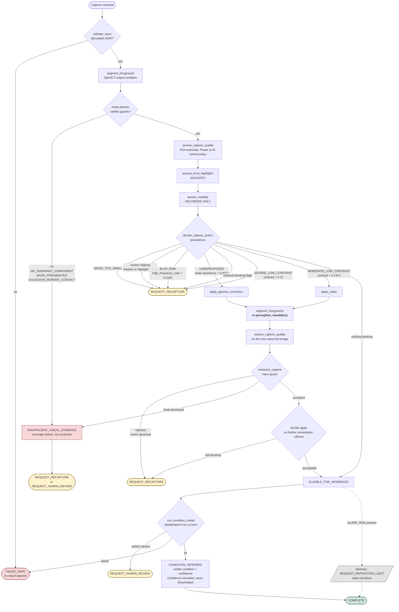

# AgriVision Agentic Vision workflow

The competition workflow diagram. One capture enters; one of six terminal states
leaves. Every branch is taken on an OpenCV measurement, and the measurement that
caused it is named on the edge.

Nothing here is decided by a language model. Actions are members of a closed
enum and tools resolve through a registry that refuses anything else, so the set
of things the system can do is fixed before it ever sees an image.

## The loop

## What the diagram is claiming

Three things, each checkable against
[`results/phase3/`](../../competition/evaluation/results/phase3/):

**The branch depends on the pixels.** The counterfactual experiment runs one
base subject through six degradations under an identical policy. Four different
first actions come out. Nothing but the image changed.

**A refused capture cannot reach the model.** `run_condition_model` is reachable
only from `ELIGIBLE_FOR_INFERENCE`, and the orchestrator raises if called from
anywhere else. Unsafe inference rate on the scenario suite is 0/12.

**Correction forces re-perception.** There is no edge from `REASSESSED` back to
`REMEDIATION_SELECTED`, so a second automated attempt is unreachable rather than
merely discouraged. Evidence measured before a pixel changed is never read after.

## Evidence maturity on the edges

The diagram does not distinguish thick edges from thin ones, so the trace does.
Every step carries the maturity of what it measured:

| Maturity | May block? | What it is here |
| --- | --- | --- |
| `CALIBRATED` | yes | Blur floor, ROI contrast, underexposure, foreground guards, severe contrast |
| `PROVISIONAL` | yes | Overexposure and both clipping limits — calibration attempted, criteria not met, Phase 1 value retained |
| `ADVISORY` | no | Local glare evidence. 0.500 detection on unseen groups against a 0.70 floor |
| `UNQUALIFIED` | never | Subject-visibility geometry; model confidence |

A blocking decision is checked against this table when it is constructed. That
is why the glare edge in the diagram is dotted: it reaches the result, not the
gate.

## Seeing it run

The loop above is live at **https://yp2ajauzkm.us-east-1.awsapprunner.com**, and the counterfactual section of that page
runs it four times on one subject:

| Variant | Next action | Condition model |
| --- | --- | --- |
| Reference | `NONE` | invoked |
| Underexposed | `APPLY_GAMMA` | invoked after re-assessment |
| Severe blur | `REQUEST_RECAPTURE` | **skipped** |
| Recoverable contrast loss | `APPLY_CLAHE` | invoked after re-assessment |

Same subject, same policy, same fingerprints. The diagram's branches are not
illustrative — those are the edges being taken.

## Where this goes next

The loop is local and deterministic. A later phase may put a language model
*beside* it to narrate a trace for a reader — never inside it, because a
narrator that can select an action is a narrator that can select the wrong one.

Full method, results and limitations:
[`PHASE3_AGENTIC_ORCHESTRATOR.md`](PHASE3_AGENTIC_ORCHESTRATOR.md).
