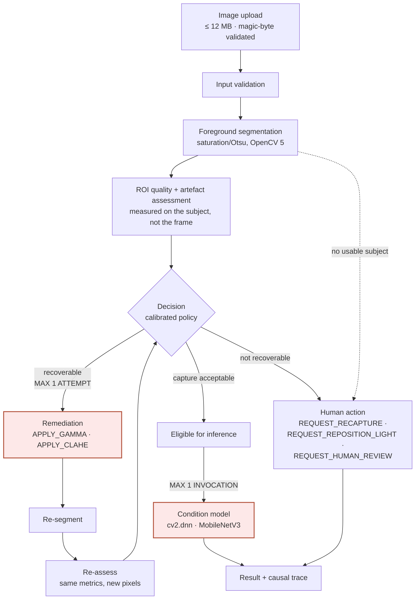

# The bounded decision loop

The workflow the orchestrator actually executes. Every edge below exists in
`LEGAL_TRANSITIONS`; a transition not in that table raises rather than being
taken, so the diagram cannot drift from the code without a test failing.

**The two bounds that matter are drawn on the diagram**, because they are the
difference between an agent and a loop that might not stop:

- **at most 1 automated remediation attempt** per inspection
- **at most 1 condition-model invocation** per inspection

Also enforced: at most 2 segmentations, and a hard ceiling of 24 steps.

---

## 1. The loop

The dotted edge is the one people miss. **When segmentation fails, no
ROI-dependent detector runs at all.** The system does not measure sharpness on a
region it could not isolate and then report the number as if it meant something;
it reports insufficient visual evidence and asks a person.

---

## 2. What decides the branch

Every decision names the metric, the threshold and the maturity of the evidence.

| Evidence | Maturity | May block? | Example action |
| --- | --- | --- | --- |
| `roi.high_frequency_ratio` below 0.3182 | CALIBRATED | yes | `REQUEST_RECAPTURE` — blur is not recoverable |
| `roi.mean_luminance` below 0.0527 | CALIBRATED | yes | `APPLY_GAMMA` — then re-measure |
| `roi.contrast_score` below 0.1314 | CALIBRATED | advisory | `APPLY_CLAHE` — then re-measure |
| shadow clipping above 0.05 | CALIBRATED | yes | `REQUEST_RECAPTURE` — the detail is gone |
| local highlight / glare | **ADVISORY** | no | reported, never blocks on its own |
| subject visibility | **UNQUALIFIED** | no | recorded, never gates |

Maturity is enforced in code, not in review: a blocking decision whose only
supporting evidence is ADVISORY or UNQUALIFIED raises `EvidenceMaturityError`.
Advisory evidence can gate only when a policy explicitly permits it, and that
permission is itself recorded in the trace.

---

## 3. Why remediation is capped at one

A second attempt would need evidence that the first one helped. That evidence
is the same measurement that failed, so a loop would be re-asking a question it
has already answered — and each pass costs a full segmentation and re-measure.

The state machine has **no edge permitting a second attempt**. It is a
structural guarantee rather than a counter someone could forget to check, and
`BOUNDED_EXECUTION_RATE` was 48/48 across the Phase 6 controlled scenarios.

---

## 4. Terminal states

Five terminals, of eighteen states:

| Terminal | Meaning |
| --- | --- |
| `COMPLETE` | a condition result was produced |
| `REQUEST_RECAPTURE` | the capture cannot support a result; take another |
| `REQUEST_REPOSITION_LIGHT` | a lighting change is more likely to help than a retry |
| `REQUEST_HUMAN_REVIEW` | escalated to a person |
| `FAILED_SAFE` | the run could not continue and refused to guess |

`INSUFFICIENT_VISUAL_EVIDENCE` is **not** terminal. It is a waypoint: the run
still has to decide which human action to request, and recording it as an
endpoint would hide that decision.

---

## 5. No language model anywhere

Actions are enum members. `resolve_tool` refuses any string outside a closed
15-name vocabulary, so no free-form text can execute a tool. The renderer that
turns a trace into English is a formatter — it runs after every decision is
made, and removing it changes nothing about behaviour.
