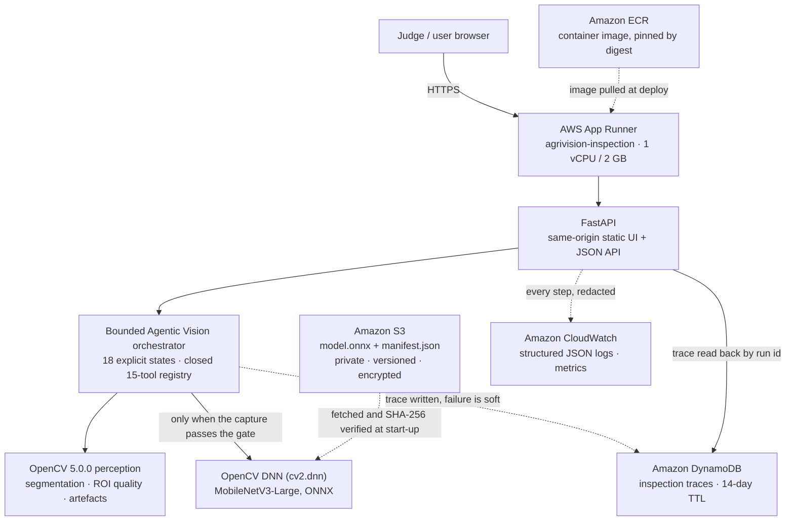
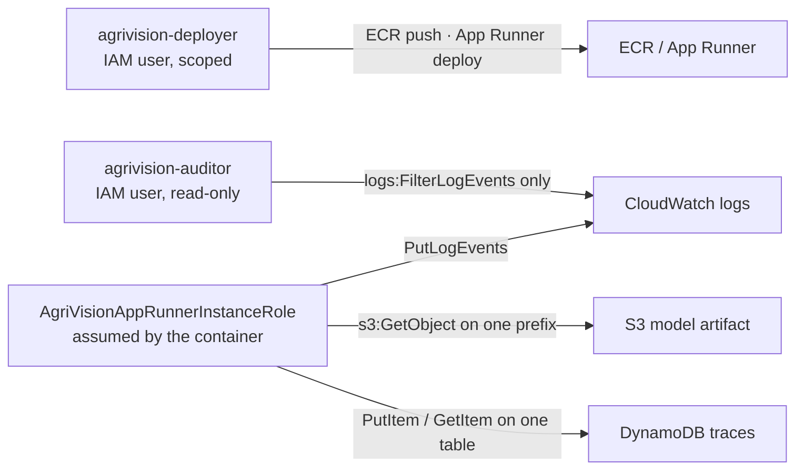
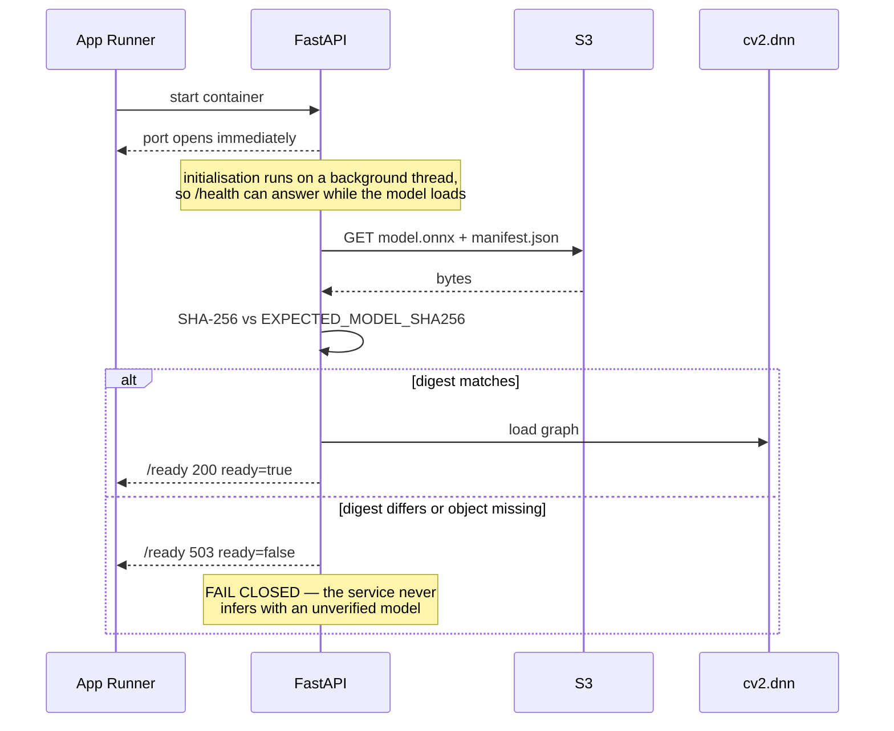

# AgriVision — deployed architecture

Every component below is deployed and exercised by the live service. Nothing is
aspirational, and nothing is included because it would look good on a diagram.

**Not present, on purpose:** Bedrock, SageMaker, API Gateway, Lambda, Step
Functions, SQS, EventBridge, Cognito, CloudFront, Amplify, VPC/NAT. No language
model participates in any decision.

---

## 1. Request path

### Why App Runner and not something larger

The workload is one stateless container that must answer an HTTP request in
under a second. App Runner provides TLS, a public URL, health checks, rolling
deployment and autoscaling with no VPC, no load balancer and no orchestrator to
operate. A Lambda would have to cold-start OpenCV and a 12 MB ONNX graph on an
unpredictable schedule; ECS or EKS would add a control plane nobody is going to
maintain after judging. The cost of the whole account is roughly **$0.72/month**
outside of judging traffic.

---

## 2. Identities

Three identities, three jobs, and no overlap:

| Identity | Can | Cannot |
| --- | --- | --- |
| `agrivision-deployer` | push images, deploy the service, read `/aws/apprunner/*` logs | read IAM, list buckets, touch DynamoDB, list log groups account-wide |
| `agrivision-auditor` | read the application log group | everything else — App Runner, S3, IAM, DynamoDB, ECR, and every write |
| `AgriVisionAppRunnerInstanceRole` | read the model object, write and read traces, write logs | anything outside those three resources |

The auditor exists for **separation of duties**, not because the capability was
missing: the deployer has held scoped `/aws/apprunner/*` log read since Phase 4.
Phase 6 recorded the opposite, inferring it from a `DescribeLogGroups` probe —
an account-wide call needing `Resource: "*"`, denied by a resource-scoped policy
— and generalising without testing. The Phase 7 record corrects it.

**The container holds no long-lived AWS credentials.** It assumes the instance
role at runtime. Root has **zero** persistent access keys and MFA enabled, and
root is not required for deployment.

---

## 3. Start-up, and what makes the service refuse to serve

`/health` is liveness and `/ready` is *can actually inspect*. They are genuinely
different: a clean-clone rehearsal observed `/health` 200 alive alongside
`/ready` false with `model_artifact_present: false`, which is the intended
behaviour and not a degraded mode.

---

## 4. Data, and what is never stored

| Data | Where | Retention |
| --- | --- | --- |
| Uploaded image bytes | held in memory for the request | **never persisted** (`retain_uploads` false) |
| Inspection trace | DynamoDB | 14-day TTL |
| Structured step logs | CloudWatch | account default |
| Model artifact | S3, private and versioned | permanent, digest-pinned |

Logs are scrubbed before emission. A CloudWatch audit of 400 live records found
no credential, authorization header, private key, local filesystem path, S3 URI
or embedded image blob.
