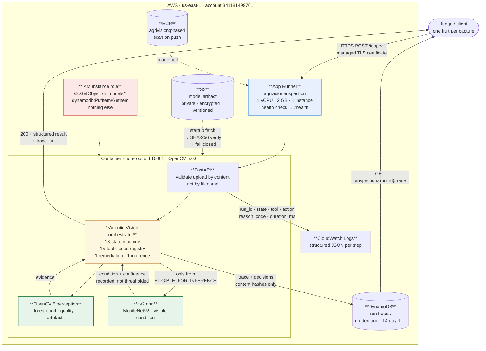

# AgriVision deployed architecture

Every box below is a service that is actually used. Nothing is drawn because it
would look impressive: API Gateway, Lambda, Step Functions, SQS, EventBridge,
SageMaker, Cognito and a VPC were all considered and none had a requirement this
service could point at.



## Request path

```mermaid
sequenceDiagram
    participant J as Judge
    participant A as FastAPI
    participant O as Orchestrator
    participant D as DynamoDB
    participant L as CloudWatch

    J->>A: POST /inspect (multipart JPEG)
    A->>A: sniff magic bytes, decode, bound size and dimensions
    alt not a usable image
        A-->>J: 400 / 413 / 415 with a reason code
    else usable
        A->>O: run_inspection(decoded array)
        O->>O: segment → measure → decide (OpenCV 5)
        opt capture acceptable
            O->>O: run condition model
        end
        O->>L: one JSON line per agent step
        O->>D: trace + decisions (content hashes only)
        Note over D: a write failure is counted and<br/>logged; the result is unchanged
        O-->>A: terminal state + trace
        A-->>J: 200 + result (even for REQUEST_RECAPTURE)
    end
    J->>D: GET /inspection/{run_id}/trace
    D-->>J: full causal trace
```

## Status semantics

A refused capture is a **successful inspection**. The system did what it was
built to do; the photograph was the problem. Answering `500` would tell a client
AgriVision is broken.

| Status | Meaning |
| --- | --- |
| `200` | The loop reached a terminal state — including `REQUEST_RECAPTURE` and `REQUEST_HUMAN_REVIEW` |
| `400` | Not a usable image |
| `413` | Upload above the size limit |
| `415` | Not a supported image format |
| `503` | Not ready — no verified model artifact — or the trace store is unreachable |
| `500` | Internal fault, with a safe body and no internals |

Clients distinguish "inspected" from "needs another photograph" by
`requested_human_action`, never by the HTTP status.

Full method and evidence:
[`PHASE4_AWS_DEPLOYMENT.md`](PHASE4_AWS_DEPLOYMENT.md).
Agent loop itself: [`AGENT_WORKFLOW.md`](AGENT_WORKFLOW.md).
